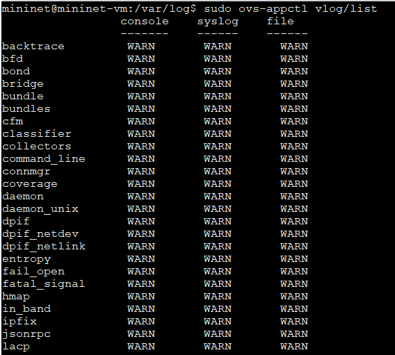
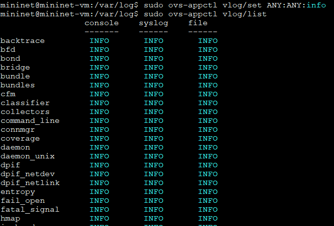

本文档介绍如何使用vlog在ovs用户态编程中进行调试。

## ovs VLOG调试方法实例

Open vSwitch具有一个内建的日志机制，它称之为VLOG。VLOG工具允许你在各种网络交换组件中启用并自定义日志，由VLOG生成的日志信息可以被发送到一个控制台、syslog以及一个便于查看的单独日志文件。你可以通过一个名为ovs-appctl的命令行工具在运行时动态配置OVS日志。

下面是ovs-appctl自定义VLOG的语法。
```
$ sudo ovs-appctl vlog/set module[:facility[:level]]
```

Module：OVS中的任何合法组件的名称（如netdev，ofproto，dpif，vswitchd等等）

Facility：日志信息的目的地（必须是：console，syslog，或者file）

Level：日志的详细程度（必须是：emer，err，warn，info，或者dbg）

在OVS源代码中，有多个严重度等级用于定义几个不同类型的日志信息：  
- VLOG_INFO()：用于报告
- VLOG_WARN()：用于警告
- VLOG_ERR()：用于错误提示
- VLOG_DBG()：用于调试信息

### 使用示例

首先查看可用模块、工具和各自日志级别的完整列表，请运行以下命令。 

该命令必须在你启动OVS后调用。
```
$ sudo ovs-appctl vlog/list
```

运行结果如下：  




可以根据需要，自行修改模块日志等级，例如：

将所有场合、所有模块的日志等级修改为info
```
$ sudo ovs-appctl vlog/set ANY:ANY:info
```

运行结果如下：



随后在程序运行过程中，可以在`/var/log/syslog`中查看自己在代码中加入的调试信息。

例如：


